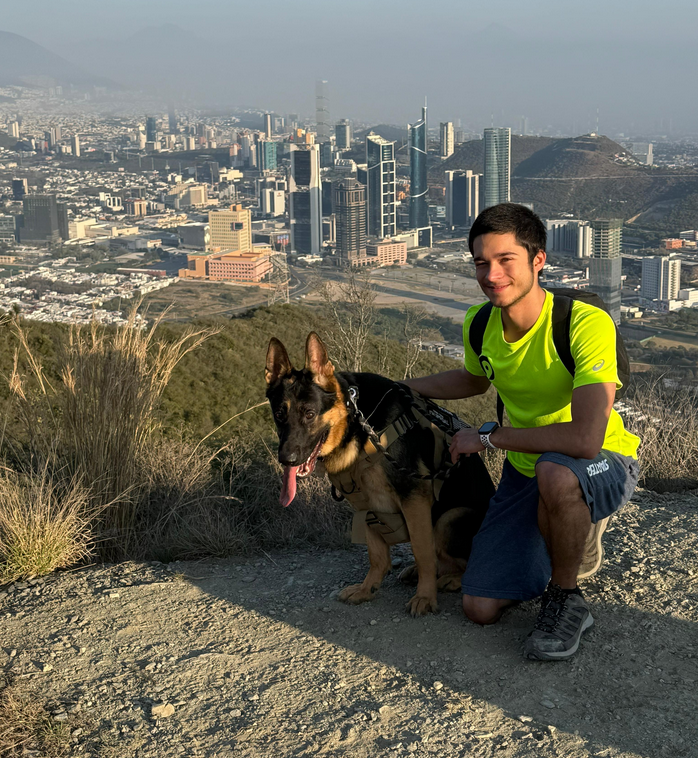

+++
date = '2024-12-06T17:23:24-06:00'
draft = false
title = 'Sobre mí'

toc = false
readingTime = false

+++

  

### ¿Quién soy?

Soy Daniel Muñoz Lozano, tengo 23 años y soy muy devoto a mi
fe católica. Me interesa la filosofía, la espistemología y el
desarrollo de software.

<!--
### Mis intereses
Catolicismo, software libre, filosofía, epistemología
-->

### Mis obras favoritas
- **Divina Commedia** - Dante Alighieri
- **Los hermanos Karamázov** - Fiódor Dostoyevski
- **1984** - George Orwell
- **Skin in the Game: Hidden Asymmetries in Daily Life** - Nassim Nicholas Taleb
- **Manhood in the Making: Cultural Concepts of Masculinity** - David D. Gilmore
- **Boys Adrift: The Five Factors Driving the Growing Epidemic of Unmotivated Boys and Underachieving Young Men** - Leonard Sax

### Atribuciones, créditos y redistribución
Este sitio fue creado con [Hugo](https://gohugo.io) y el
tema [Stack](https://github.com/CaiJimmy/hugo-theme-stack)
de [Jimmy](https://jimmycai.com). Además, todo el contenido
de este sitio está protegido bajo la licencia CC BY-NC-ND
4.0, lo cual a grandes rasgos significa que se puede
redistribuir siempre y cuando se proporcione crédito al
autor, no se modifique lo dicho y se redistribuya sin fines
comerciales. Por otro lado, el [código de este sitio
web](https://github.com/danielml-mx/danielml.mx) se puede
redistribuir bajo los términos de la GPLv3 (la única
licencia de código buena).

### Contacto
- Correo: [``yo@danielml.mx``](mailto:yo@danielml.mx)
- Número: [``+52 81 8687 3759``](tel:528186873759) 

***
