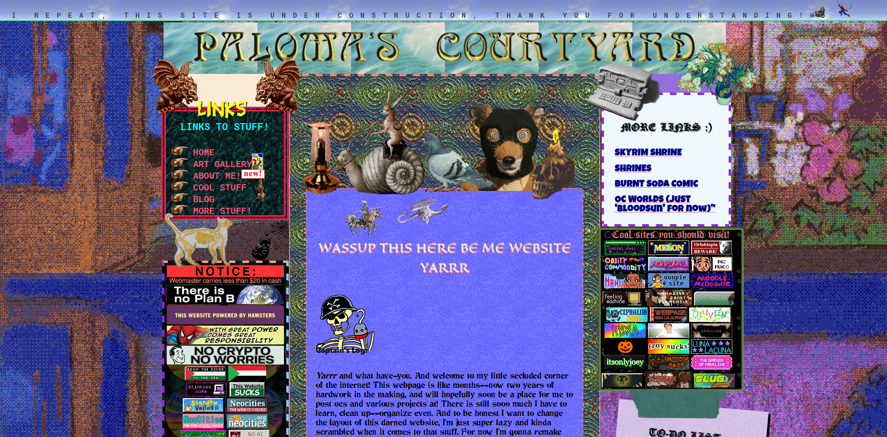
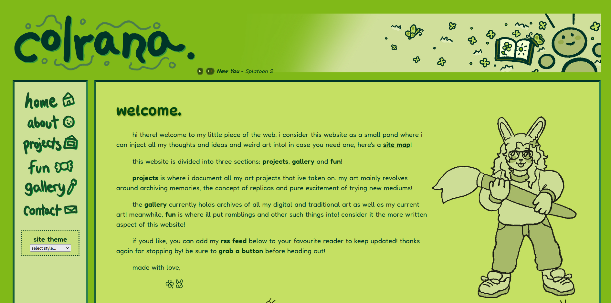
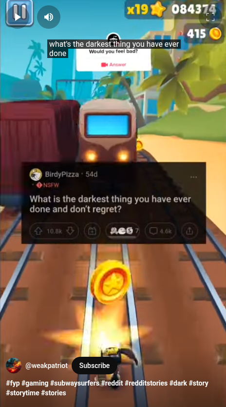

*Este artículo fue publicado originalmente en la [revista
jurídica del Tecnológico de
Monterrey](https://dichoyderecho.com.mx/posts/creatividad-en-la-era-de-la-inteligencia-artificial/).
Lo escribí algo apresuradamente, pero igual contiene
aportaciones valiosas.*

## El viejo oeste
Cuando el internet empezó a volverse accesible para todos en
los años noventa, navegar en línea era algo totalmente
diferente a lo que nosotros conocemos ahora. Muchos jóvenes
ni siquiera sabe cómo se veía ese panorama. Cuando el
internet era lo suficientemente grande para llamar la
atención de los consumidores pero demasiado nicho como para
monetizarlo, este estaba dominado por sitios web personales;
no había Facebook, Instagram, WhatsApp, ni siquiera Google.
Muchos de estos sitios eran feos y difíciles de navegar,
pero de alguna manera cada uno de ellos era un reflejo de la
creatividad del usuario detrás de él, tan extraño y único
como su creador. Además, dado que nadie consideraba siquiera
posible obtener una ganancia monetaria de lo publicado, lo
creado no podía venir más que de un verdadero sentido de
pasión por el arte. Era el viejo oeste digital, por así
decirlo, donde no había reglas, y cada sitio podría ofrecer
algo totalmente nuevo y desconocido.

  

  
  <figcaption style="display: inline-block; height: 1.5em;  text-overflow: ellipsis;  max-width: 70%;" >

  </figcaption>

<i>Algunos ejemplos de la vieja red.</i>

La constitución de la web cambió después de que se volvió
monetizable. Donde antes "navegar la red" implicaba visitar
todo tipo de sitios diferentes, hoy implica navegar los
mismos tres/cuatro sitios o "apps" ---generalmente TikTok,
Instagram y Twitter. A pesar de que esta centralización
indudablemente potenció la cantidad de contenido a nuestro
alcance y volvió la red mucho más accesible para muchos,
también cambió para siempre la forma del contenido
compartido. Gracias a que ahora las plataformas de contenido
se redujeron a un puñado, el aspecto artístico y único de la
red se vio estandarizado, limitado tan sólo a lo que
Facebook/Twitter/TikTok permitiera. Además, la motivación
detrás de la creación de contenido también cambió. Proyectos
de pasión rápidamente fueron opacados por contenido poco
genuino intentando "viralizarse" a fin de sacar un lucro o
simplemente llamar la atención.

En resumen, antes el internet era descentralizado, único,
genuino e independiente; ahora, gracias a que le pertenece a
unos cuantos distribuidores de contenido buscando maximizar
ingresos, es centralizado, predecible, algo falso y, a
través de algoritmos, manipulable.

## Algoritmos y automatización

Fuera del hecho de que los propios distribuidores tienes los
medios y los motivos para manipular el contenido que
consumimos ---evidenciado por episodios como el escándalo de
[Cambridge
Analytica](https://en.wikipedia.org/wiki/Facebook%E2%80%93Cambridge_Analytica_data_scandal)
y la manera en la cual Twitter ha cambiado radicalmente
después de que Musk tomó cargo---, la realidad de las cosas
es que también ha cambiado drásticamente el contenido
producido por personas comunes. Casos abundan de personas
buscando aprovechar el algoritmo para producir contenido que
minimiza esfuerzo y maximiza alcance. 

Un notorio ejemplo de esto en el mundo de la tecnología es
el canal de [Roel Van de
Paar](https://www.youtube.com/c/RoelVandePaar), quien
utilizó un algoritmo para crear [millones de videos de
YouTube](https://www.youtube.com/watch?v=pz68p6ycV3k) en los
cuales una computadora leía respuestas técnicas de un foro
en línea (respuestas escritas por personas reales quienes no
reciben atribución por solucionar el problema). En esencia,
esta persona esta sacando un lucro de una manera muy floja y
en base al trabajo de otros.

Este es un caso particular, pero anteriormente también
abundó la tendencia de perfiles y perfiles en los cuales una
voz computarizada leía publicaciones de Reddit y publicaba
los videos automáticamente, todo con una intervención mínima
de parte del individuo detrás del perfil, y para colmo con
un estímulo de bajo compromiso de fondo, como un "gameplay"
de GTA, Minecraft o Subway Surfers.

  

<i>Esto es lo que ven tus primitos, por cierto.</i>

El punto que estoy intentando hacer aquí es que este
contenido, de muy baja calidad y evidentemente diseñado con
intenciones de manipular a los usuarios a verlo por la mayor
cantidad de tiempo a fin de obtener un lucro, es
radicalmente diferente al contenido genuino que abundaba
anteriormente. Y esto es sólo con algoritmos y
automatización. Todavía ni siquiera hablo de la inteligencia
artificial...

## Inteligencia artificial, contenido artificial 

La inteligencia artificial sólo hará que el contenido que
consumimos en internet sea peor, no mejor. Ya ha ocurrido
con los motores de búsqueda, pues se han vuelto altamente
manipulables y arrojan más que nada artículos generados por
inteligencia artificial, diseñados no para responder tu
pregunta, sino para maximizar su relevancia (a través del
SEO, *search engine optimization*) y cuan frecuentemente
aparecen con cualquier búsqueda, de tal manera que ahora es
casi obligatorio terminar una búsqueda con "... reddit" para
obligar al motor a arrojar contenido creado por personas
reales y que de hecho responde tu pregunta.

Peor aún, ahora que la generación de imágenes y videos por
inteligencia artificial se han vuelto una herramienta
ampliamente disponible para todos, el internet está cada vez
más lleno de "[slop](https://en.wikipedia.org/wiki/AI_slop)"
---contenido de baja calidad generado por inteligencia
artificial, frecuentemente insensato. Vale la pena
preguntarse, entonces, ¿qué pasó con aquella tierra
prometida, la cual solía ser un oasis para todo tipo de
contenido original? La triste realidad es que ahora no es
más que un
[páramo](https://en.wikipedia.org/wiki/Dead_Internet_theory).

