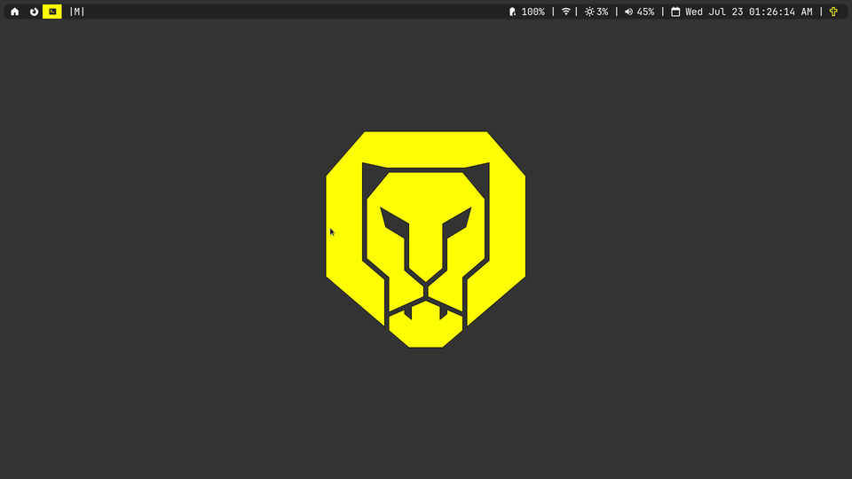

Dejo aquí una lista de lo que uso cotidianamente. En general
priorizo programas libres, ligeros, rápidos y estéticos que
sigan la [filosofía de
UNIX](https://en.wikipedia.org/wiki/Unix_philosophy),
mientras que para *hardware* busco que puedan cumplir con
varios propósitos. A menos que me sea imposible, evito
software y hardware restrictivo como las Macs, Windows,
Chrome, Adobe Reader, etc.

Todos estos programas se encuentra o en los repositorios
oficiales de Arch o en el repositorio de usuarios (AUR).
Además, puedes consultar los archivos de configuración que
uso con muchos estos programas en el [repositorio de mis
archivos de
configuración](https://github.com/danielml-mx/dotfiles).

## Hardware
- **Computadora:** ThinkPad L13 Yoga Gen 2 con un procesador 11th Gen Intel i5-1145G7 (8) @ 4.400GHz
    - Esta laptop es lo más cercano que he encontrado a una laptop perfecta. Incluye un trackpoint, una pantalla táctil con pluma y un factor de forma ligero, aunque desearía que fuera tan sólo un poco más pequeña la relación de aspecto, algo así como la X200 clásica, y además como muchas laptops modernas las opciones de mejora son limitadas.
    - La pantalla táctil la verdad deja mucho que desear. No
      es tan amigable de usar como esperaba, y tiene varios
      problemas al detectar la pluma, pero basta para tomar
      unas cuantas notas.

## Software
- **Sistema operativo:** [Artix Linux](https://artixlinux.org)
    - Arch Linux sin SystemD. Es básicamente lo mismo pero
      mejor.
- **Manejador de ventanas:** [dwm](https://dwm.suckless.org)
    - [Fork personal](https://github.com/danielml-mx/dwm)
    - Hace mucho tiempo utilizaba KDE y me pareció el mejor entorno de escritorio de las opciones disponibles. También he intentado Wayland, particularmente hyprland, pero no me parece que esté suficientemente desarrollado todavía. 
- **Barra de estatus:** la predeterminada de dwm (con parches) + [dwmblocks-async](https://github.com/UtkarshVerma/dwmblocks-async)
- **Compositor:** [picom](https://github.com/yshui/picom)
- **Terminal:** [st](https://st.suckless.org/) con [tabbed](https://github.com/danielml-mx/tabbed)
- **Shell:** zsh
    - No utilizo ohmyzsh, sino he instalado los plugins de autocomplete, autosuggestions y syntax-highlighting.
    - Para el prompt personalizado, utilizo [p10k](https://github.com/romkatv/powerlevel10k) instalado manualmente.

  
  <figcaption>Breve demostración del software mencionado hasta ahora</figcaption>

- **Audio:** [PipeWire](https://wiki.archlinux.org/title/PipeWire)
- **Daemon de notificaciones:** dunst
- **Editor de texto:** [neovim](https://neovim.io/)
- **Navegador de archivos:** [lf](https://github.com/gokcehan/lf) con [ueberzugpp](https://github.com/jstkdng/ueberzugpp)
- **Navegador web:** [LibreWolf](https://librewolf.net/)
    - Fork de Firefox orientada a la privacidad y seguridad, aunque debo admitir que algunas de las funcionalidades que esperas de la web moderna no siempre funcionan con LibreWolf.
- **Visualizador de documentos:** [sioyek](https://github.com/ahrm/sioyek)
    - Anteriormente utilizaba zathura ([video](https://www.youtube.com/watch?v=d6zodqSFN60)), sin embargo se volvió bastante inestable.
- **Visualizador de imágenes:** sxiv
- **Reproductor de multimedia:** mpv

