*Note: This guide was originally written in 2022. I am simply porting it over from my old website. Some of the information is outdated. You are encouraged to read the footnotes added to figure out what has changed.*

The original, time-tested guide to Librebooting an X200 can be found [here](https://www.reddit.com/r/libreboot/comments/7dajn6/x200_libreboot_tutorial_for_raspberry_pi_with/)[^1]. This guide is sort of an update to it with a couple of additions based on my experience. I'm not going to bore you with an introduction on what Libreboot is, it's niche enough that I don't believe you stumbled upon this by accident.

### Materials
-   A USB drive, if you wish to update your EC firmware
-   A screwdriver (only a Phillips-head one, this isn\'t a Mac)
-   Jumper wires, female to female; the smaller the better
-   A programming board; in this guide we will be using a Raspberry Pi
    -   A quick note on the CH341A: the Libreboot documentation [recommends against its use on the grounds that it may damage your motherboard](https://libreboot.org/docs/install/spi.html#do-not-buy-ch341a).
        That being said, and truth be told, I\'ve never seen a motherboard damaged by it. Use it at your own discretion.
-   A SOIC-8 or SOIC-16 clip, depending on your board (see
    [Disassembly](#Disassembly))
    -   Unlike the Raspberry Pi, the Pomona clips are definitely overpriced. That being said, if you instead choose to go with the cheap Chinese clips, you will have to modify them a little to get them working; this is documented here and is what I did.
-   A libre Wi-Fi card
    -   Strictly speaking this isn\'t a requirement for Libreboot, but now that you\'re out shopping you should probably also get a new Wi-Fi card since the stock one won\'t work with *linux-libre*. Anything Atheros should work, I got the AR9280. Don\'t worry about sizes, the X200 has screwholes for both full- and medium-sized cards.


### EC firmware


#### Updating the EC firmware{#Updating_the_EC_firmware}

This isn\'t a step that is absolutely necessary to Libreboot your X200, but the official Libreboot documentation does recommend [updating the EC firmware on your computer before flashing](https://libreboot.org/docs/hardware/#ec-update-on-i945-x60-t60-and-gm45-x200-x301-t400-t500-r400-w500-r500), since it can\'t be done afterwards.


If you\'re anything like me, you\'re already puking a little just thinking about having to deal with Windows to run the update utility. Fortunately for you, I searched around the internet and found a way to make a bootable USB of this utility all within Linux. There\'s this thing called `grub2dos` which can be used to directly boot these sorts of utilities. Basically you need to do [this](https://bbs.archlinux.org/viewtopic.php?pid=1411375#p1411375), but let me elaborate:


1.  First, download the ISO of the Lenovo BIOS update utility:

    `wget https://download.lenovo.com/ibmdl/pub/pc/pccbbs/mobiles/6duj48us.iso`

2.  Then copy it to your USB drive. Make sure it\'s empty and FAT32.
    Assuming you\'ve mounted on `/mnt`, you\'d do:

    `cp 6duj48us.iso /mnt`

3.  Now download `grub2dos`. You can get it from [here](https://sourceforge.net/projects/grub4dos/files/GRUB4DOS/grub4dos%200.4.4/). Unzip it, `cd` into it and copy `grldr` into your USB.

```sh
unzip grub4dos-0.4.4.zip
cd grub4dos-0.4.4
cp grldr /mnt
```

4.  At this point you can execute the utility that installs `grub2dos` on your USB. Make sure you point it to your device though, not your mounting point.
```sh
sudo ./bootlace.com /dev/sdX # where sdX refers to the corresponding USB drive
```

5.  Finally, create `menu.lst` in the root directory of your drive and include the following in it:
```
/mnt/menu.lst
```
```
color blue/green yellow/red white/magenta white/magenta
timeout 30
default /default

title ThinkPad BIOS Update
map (hd0,0)/6duj48us.iso (hd32)
map --hook
chainloader (hd32)
boot
```

Now you can unmount the drive and plug it into your Thinkpad. Once you\'ve booted into the Lenovo utility, make sure you select the second option, \"Update system program\". From there on out it\'s pretty intuitive, just follow the instructions and return to the menu to try and update again. If it tells you that there\'s nothing more to do, you\'re all set.

#### Custom EC firmware{Custom_EC_firmware}

##### Context{Context}

You\'re probably wondering why you\'d even want to do this. You see, on many newer Thinkpads, swapping the left function and control keys is an option available in the stock BIOS (which actually changes the EC firmware since the Fn-Ctrl option resides there and is made permanent once you flash Libreboot). Unfortunately, this option was introduced with the XX10 series Thinkpads. I **really** didn\'t want to have to get used to the function key being the leftmost key of the bottom row, so I scavenged several online forums and managed to gather enough information on how to flash a specific custom EC firmware payload(?) on the X200 that swaps these two keys. If you just want the specific ISO image that swaps out Fn and Ctrl, go to the end of this section, but if you want to understand what I did, keep reading, it\'s a funny story.


Anyone who ever searched for a way on how to swap these keys on the X200 probably stumbled across [this](https://superuser.com/questions/866818/swap-fn-and-ctrl-keys-on-a-lenovo-thinkpad-x200) post which links to another forum post in which an unofficial BIOS for the X200 with the swap was provided. Unfortunately, the forum which hosted the post with the unofficial BIOSes closed a while ago, and [the link now points to something else](http://forum.notebookreview.com/threads/fn-ctrl-swap-on-all-lenovo-laptops-solved.474396/). Initially I thought that was the end of it. It wasn\'t until much later that it occurred to me that the post might\'ve been saved on the WayBack machine, and lo and behold, [some gigachads out there were smart enough to take a snapshot of the post](https://web.archive.org/web/20190210162408/http://forum.notebookreview.com/threads/fn-ctrl-swap-on-all-lenovo-laptops-solved.474396/). The post includes all unofficial BIOSes that swap the Fn-Ctrl keys, made by a guy named Middleton. We\'re concerned with [the one for the X200 here](https://www.mediafire.com/file/6cpk2tn37kp7ura/CTRL-FN_ThinkPad_X200_X200s_BIOS_%25283.14-1.06%2529.rar/file) but there\'s also one for the T400 and other Thinkpads, if you\'re interested. Be warned though, how Middleton reverse-engineered these BIOSes remains unknown to me, **so you are fully responsible if you choose to flash one of these on your machine**.

If you happen to be running Windows on your X200 and have BIOS version 3.14 with EC firmware version 1.06, then you could just try running the utility provided in the MediaFire link above. But since you probably don\'t, I also figured out a way to create a bootable USB with this image, similar to what is documented above when updating the EC firmware, guided also by the penultimate answer on the first post linked.

Basically what I did was download the original BIOS update utility which updates (or downgrades) precisely to the BIOS and EC firmware versions used by Middleton to swap the keys, which is [`6duj41uc.iso`](https://download.lenovo.com/ibmdl/pub/pc/pccbbs/mobiles/6duj41uc.iso). As the aforementioned answer stated, what you need to is swap out the files `$01B9000.FL2` and `$01B9100.FL2` from the original ISO image for the similarly-named but modified files found in Middleton\'s utility. Unfortunately, the Lenovo ISO image was made with a very esoteric format which meant that most extracting software just wouldn\'t work with it. Long story short, I eventually found a piece of software that could extract the files and used a script called `breplace.cpp` (found [here](https://cristianadam.blogspot.com/2015/01/lenovo-fn-ctrl-swap.html)) that replaced the necessary files. I did:

```sh
g++ breplace.cpp -o breplace
./breplace 6duj41uc.iso \$01B9000.FL2-og \$01B9000.FL2-swap 6duj41uc-new.iso
./breplace 6duj41uc-new.iso \$01B9100.FL2-og \$01B9100.FL2-swap 6duj41uc_fn-ctrl-swap.iso
```

##### The tool{The_tool}

But to spare you all these troubles, [here](6duj41uc_fn-ctrl-swap.iso) is the modified ISO file that includes the Fn-Ctrl swap. To make a bootable USB out of it, follow [the instructions on updating the EC firmware](#Updating_the_EC_firmware) but using this ISO file instead of the newest one. (Also, if you\'re unlucky enough to have precisely BIOS 3.14 and EC firmware 1.06 but not Windows, you will have to first update/downgrade with any other ISO image, then use the modified one.)

##### Wait, does that mean I can\'t have the updated EC firmware and the Fn-Ctrl swap?

Middleton made his modified BIOS with EC firmware version 1.06, so unfortunately yes, updating to 1.07 will roll back the swap. I searched online for alternatives for swapping the Fn and Ctrl keys, but I found nothing solid. [This](https://github.com/merge/skulls/issues/57)[^2] Github issue reports that `nvramcui` has an option to swap them. Seeing how `nvramcui` is a payload of SeaBIOS which itself is a payload of Coreboot and Libreboot is just a distribution of Coreboot, it might be possible to build Libreboot with SeaBIOS including `nvramcui` as a secondary payload, but I did not tinker with `lbmk` enough to figure it out. Moreover, `nvramcui` may just be modifying preexisting variables in the EC firmware, and given that it simply does not exist in the X200\'s EC firmware, who knows if it would actually work.


### Disassembly{#Disassembly}

*Note: If you can\'t find a sticker at the bottom of your X200 with labeling its MAC address, you should probably boot into your BIOS menu and write it down before disassembling; you\'ll need it later when you\'re flashing.*

You\'ll want to disassemble your Thinkpad even before buying the materials. This is because the SPI chip on any given X200 can be either SOIC-8 (4 pins on each side, 8 in total) or SOIC-16 (8 pins on each side, 16 in total). From what I\'ve seen it\'s most often SOIC-16, but it\'s worth double-checking. You don\'t want to be the guy who bought a SOIC-16 clip but needed a SOIC-8 one.

Fortunately for us, the SPI chip is readily accessible in the front of the laptop\'s motherboard. This means that all you need to do to access it is remove the screws holding the keyboard and palm rest in place. After unplugging from power and removing the battery, just remove any screws that have either one or both of these icons:

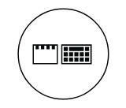

If this is your first time removing them, they may be quite tight. To avoid stripping them, remember that the best way to remove them is to strongly apply **vertical** pressure and gently rotate the screwdriver, not the other way around.

Remove the keyboard by gently pushing it towards the screen and then upwards. Disconnect it from the motherboard, as well as the fingerprint reader, if applicable. Remove the palm rest by pushing it towards you from the edge that faces the keyboard. You should consult the [X200\'s hardware manual](https://download.lenovo.com/ibmdl/pub/pc/pccbbs/mobiles_pdf/x200_x200s_x200si_x201_x201i_x201s_hmm_en_43y6632_11.pdf) for more information on the disassembly and reassembly (see Chapter 8, sections \"1040 Keyboard\" and \"1050 Palm rest or palm rest with fingerprint reader\").

The SPI chip is located a bit to the left, right below where the palm rest was:

### Setting up the Pi{Setting_up_the_Pi}

The first thing you\'re going to want to do is download and unzip the image file of Raspberry Pi OS to burn it unto the SD card. You can get it from [here](https://www.raspberrypi.com/software/operating-systems/#raspberry-pi-os-32-bit) and do it manually or be efficient and do:

```sh
wget https://downloads.raspberrypi.org/raspios_armhf/images/raspios_armhf-2022-01-28/2022-01-28-raspios-bullseye-armhf.zip
unzip raspios_armhf-2022-01-28/2022-01-28-raspios-bullseye-armhf.zip
```

Now just burn that image to the SD card (not the mounting point). Assuming your card is **mmcblk0**:

```sh
sudo dd if=raspios_armhf-2022-01-28/2022-01-28-raspios-bullseye-armhf.zip of=/dev/mmcblk0 bs=4M
```

Insert the card into the Pi and ready it up the Pi for normal use (i.e. connect it to power and peripherals). My monitor often acts weird, so I had issues getting the desktop to show up; if this also happens to you, I managed to fix it by connecting it to a TV, seeing the image there, powering off and then connecting it again to my monitor.

Open up a terminal with `Ctrl+Alt+T` and update and upgrade.


```sh
sudo apt-get update && sudo apt-get dist-upgrade && reboot
```

Now run:


```sh
sudo raspi-config
```

Go to **6 Advanced Options** and hit Enter on **A1 Expand Filesystem**. Reboot.

Now run `raspi-config` again and go to **3 Interface Options**. Hit Enter on **I2 SSH**. (If you\'re really picky about security, you might want to change the default password first; the default username and password are \"pi\" and \"raspberry\" respectively). Come back to this menu and enable **I4 SPI** and **I5 I2C**.


Now do `$ ifconfig` and note your IP address, after \"inet\". Use it to SSH into your Pi from another Linux machine .

```sh
$ ssh pi@192.168.0.0
```

By now we need to install `flashrom`. We actually need to use a [specific version of `flashrom`](https://libreboot.org/docs/install/spi.html#install-flashrom) designed to work with the X200. Make a directory to work in, then get the modified `flashrom`:

```sh
mkdir x200 && cd x200
wget https://vimuser.org/hackrom.tar.xz && tar -xf hackrom.tar.xz
cp hackrom/flashrom .
```

Your Pi is now ready to flash. **Power it off for now to safely connect the clip to it and then to the motherboard.**

### Connecting the clip{Connecting_the_clip}

#### Preparing the cheap clip{#Preparing_the_cheap_clip}

The cheap clip isn\'t properly designed and the jumper wires can\'t fit without a little bit of hacking. There\'s multiple ways you can hack it to make it useful. I decided to straight-up remove the pins that were in the way since you can easily put them back and even if you break one (like me), well, do you really plan on using this clip for something other than the specific pin layout for the X200? Anyways, assuming this is what you also want to do, you should know that the clip can fit two pins next to each other only if you remove the third one next to them. Basically:

<figure class="centerimg">
<a href="remove-pins.png">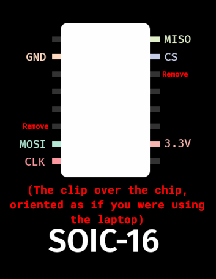</a>
<figcaption>Thanks to <a
href="https://www.youtube.com/c/WolfgangsChannel">Wolfgang</a> for the
original image.</figcaption>
</figure>

I used a pair of pliers to get them out. Here\'s what your clip should look like before and after the modifications:

<figure class="centerimg">
<a href="clip-before.jpg">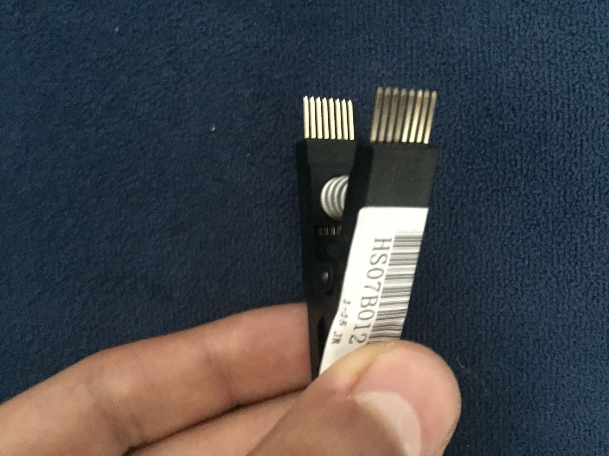</a> <a
href="clip-after.jpg">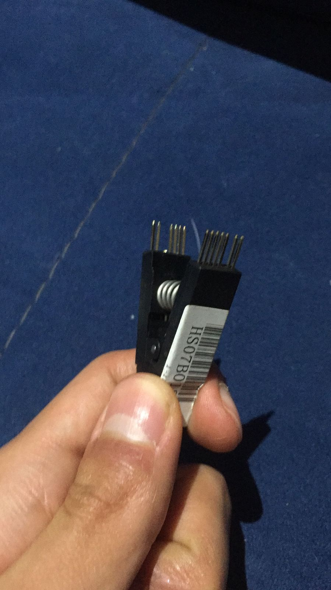</a>
<figcaption>Before // After</figcaption>
</figure>

And as a side note, if you don\'t want to break them putting them back like I did, push the pins until the second notch touches the black plastic of the clip. Once there, use something like the back of a screwdriver to gently sort of hammer it back in place. Above all, don\'t try to push it by pressing it against something.

Also, remember that this is SOIC-16. I don\'t know if the cheap SOIC-8 clip has enough space to fit the jumper wires, but if it doesn\'t, you can probably also just remove the pins that are in the way. Make sure you remove the ones corresponding to your pin layout though, as they are **not** the same for SOIC-8 and 16.

#### Preparing the Pomona{#Preparing_the_Pomona}

<p style="text-align:center">

</p>


#### Wiring it up{#Wiring_it_up}

The clip doesn\'t have any specific orientation with which it needs to be connected, but the chip does have specific pins that need to be relayed from the clip to the Pi in a specific way. What I\'m trying to say here is that you should pick one of the corners of your clip and align it with the chip\'s layout. In the following images, I chose the side with the label and the corner closest to its text, so I planned on connecting my clip and wires like this:

<figure class="centerimg"
style="display: flex; align-items:center; justify-content:center;">
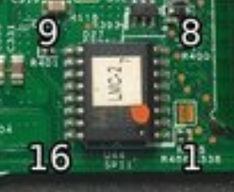 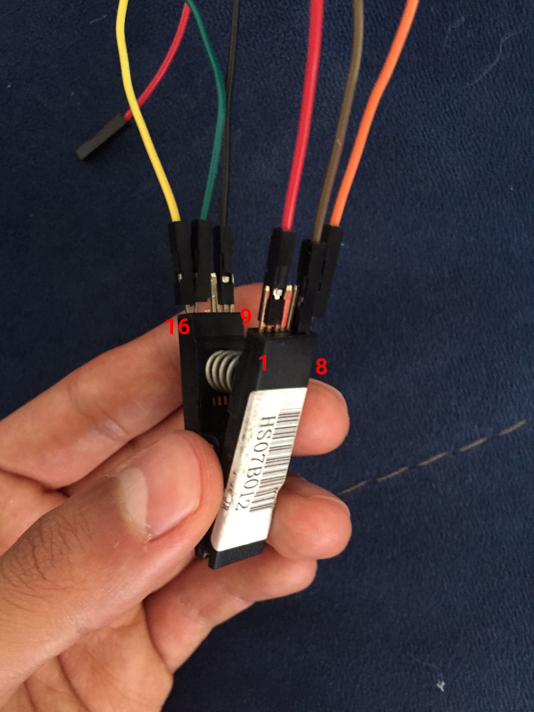
</figure>


Once you\'ve decided on the orientation of your clip, you can correctly connect the jumper wires to their corresponding pins. The pin layout for the SOIC-16 clip/chip is this:

<figure class="centerimg">
<a href="soic16-pinout.png">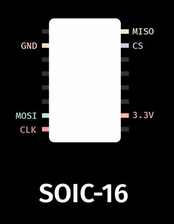</a>
<figcaption>Thanks to <a
href="https://www.youtube.com/c/WolfgangsChannel">Wolfgang</a> for the
image. The chip is oriented as the one in the image above.</figcaption>
</figure>

Please use this pin layout. **The SOIC-16 layout on the original R\*ddit guide is wrong**.

Once the jumper wires are on the clip, you can proceed to connect the wires to the Pi. You must connect them like this:

<figure class="centerimg">
<a href="librex200-layout-complete.jpg">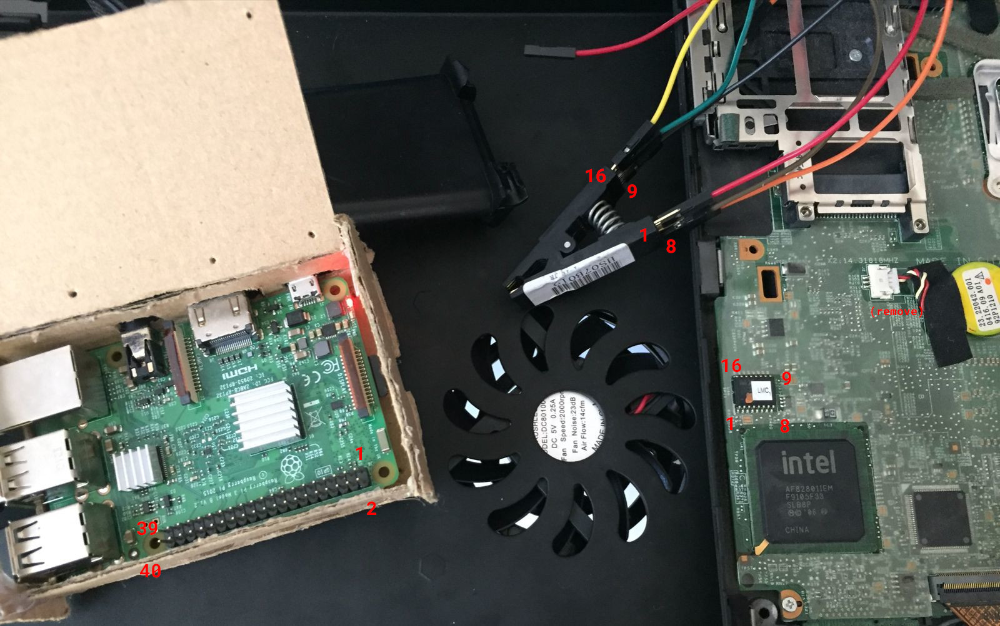</a>
<figcaption>Note that the Pi is turned on. It should actually be off. Also note the CMOS battery.</figcaption>
</figure>

<figure class="centerimg">
<a href="soic16-to-pi.png">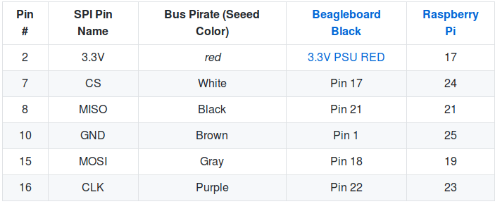</a>
<figcaption><a
href="https://github.com/bibanon/Coreboot-ThinkPads/wiki/ThinkPad-X200">Source</a></figcaption>
</figure>

All wired up, your setup should look a little like this:

<figure class="centerimg">
<a href="lx200-pi-clip.jpg">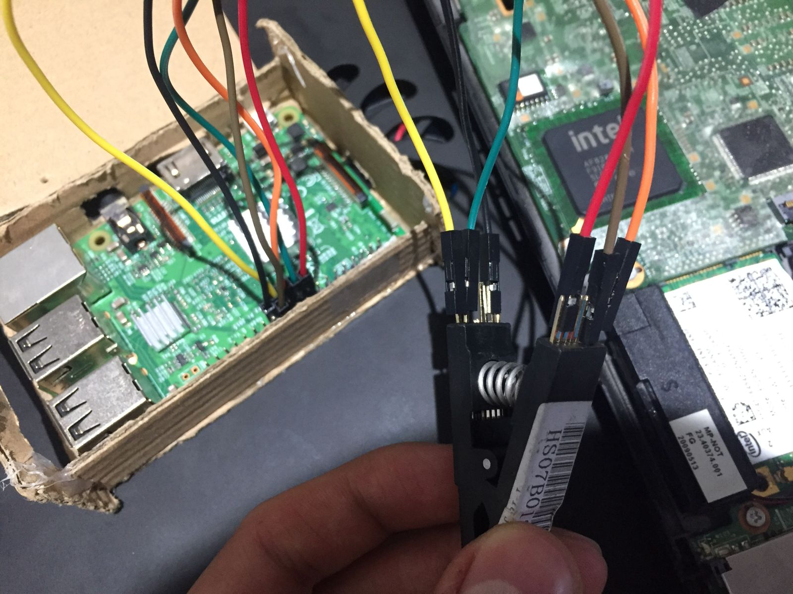</a>
<figcaption>Please be patient during this step. Counting the pins and finding the right one for a particular wire can be quite tedious, so take it easy.</figcaption>
</figure>

Before you clip the chip though, you must figure out what the model of ROM chip is. It is labeled on to of the chip, though it will most likely be covered by a sticker. In the ideal scenario you peel the sticker off and then use something like rubbing alcohol to remove its remains, but since I don\'t have that I did it the ole\' fashioned way of licking your finger and gently tapping the sticker, then peeling it off. The good news is that you only really have to uncover one or two digits. As far as I know the chip can only be **MX25L6405**, **MX25L6406E/MX25L6436E** or **MX25L6445E/MX25L6473E**. In my case, the sticker didn\'t cover anything before \"MX25L640,\" so I only had to uncover one more digit to distinguish it from the rest. Write your model number down, you\'ll need it later.

<figure class="centerimg">
<a href="mx-chip.jpg">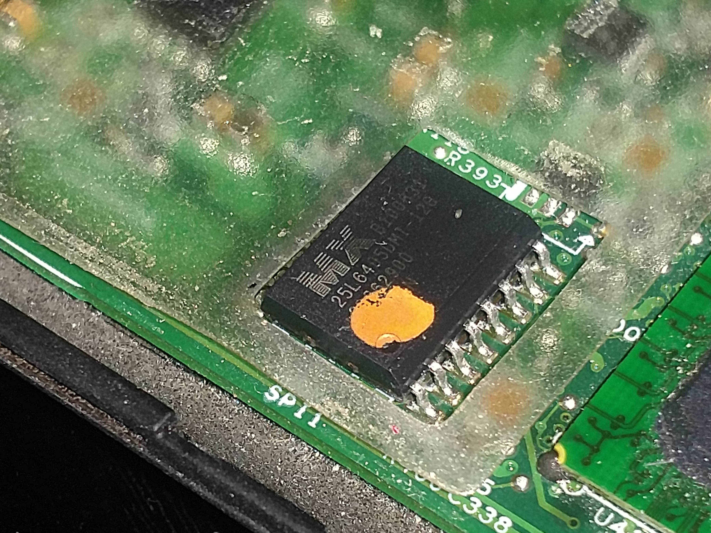</a>
<figcaption><a href="https://imgur.com/utpeUQe">Source</a></figcaption>
</figure>

Though you should probably wait until you\'ve chosen your Libreboot ROM, you can now clip the chip. **With the Raspberry Pi turned off**, open the clip up and place it over the chip. Remember the orientation you chose for the clip and place it accordingly. Make sure you align the clip\'s pins with those of the chip.

<figure class="centerimg">
<a href="lx200-clipped.jpg">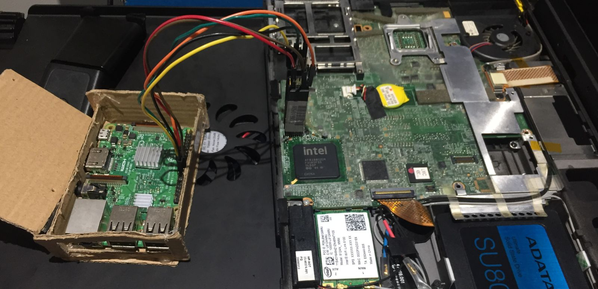</a>
</figure>

At this point you can turn your Pi on. **Remember that you must not clip the chip with the Pi turned on.**

### Getting Libreboot{#Getting_Libreboot}

There are multiple ways for you to get a Libreboot ROM, each catering to different needs. All of them, however, provide `4mb`, `8mb`, and `16mb` versions. The 4 megabyte ROMs are for SOIC-8 chips and the 8 megabyte ROMs are for SOIC-16 chips (I don\'t know what the 16 megabyte ROMs are for). In any case, you can confirm your chip size during the first steps of the flashing phase.

#### Using a prebuilt ROM{#Using_a_prebuilt_ROM}

Most people will probably want to use a prebuilt, stable, GRUB ROM. The mirrors to download them are available [here](https://libreboot.org/download.html#https). The most recent stable X200 ROMs are available under `stable/20160907/rom/grub/`. You should also download `stable/20160907/libreboot_r20160907_util.tar.xz` as it includes the utilities that we will be using later to add your MAC address to the ROM. [^3]

#### Making your own ROM{#Making_your_own_ROM}

*Relevant: [Guide from the official Libreboot documentation](https://libreboot.org/docs/build/)*

If you, for some reason, have a particular need or just want to tweak the Libreboot ROM, then you might have to build your own ROM. To do this, you have to use the utility called `lbmk` (short for LibreBoot MaKe). You can get it directly from the repo[^4]:

```sh
git clone https://notabug.org/libreboot/lbmk && cd lbmk
```

And to install its dependencies:

```sh
# Obviously pick your distro

sudo make install-dependencies-arch
#sudo make install-dependencies-void
#sudo make install-dependencies-debian
#sudo make install-dependencies-ubuntu
```

You should tinker with it a bit. The binary file you\'re probably going to use the most is `build`. As an example, to build all ROMs available for the X200 SOIC-16 version, you do:

```sh
./build boot roms x200_8mb
```


#### Using SeaBIOS with harbour.sh{#Using_SeaBIOS_with_harbour_sh} [^5]

Looking around I found [this](https://gitlab.com/man-with-arrow/harbour) script called `harbour.sh` that can modify the stable releases of Libreboot (which, for the most part, use GRUB only) to add SeaBIOS to the ROM, effectively turning it from a `grub` ROM to a `seabios_withgrub` ROM. The script is very well made and even takes care of downloading the correct ROM for you. If for some reason you want to use SeaBIOS instead of GRUB, then you might want to consider doing this.

### Editing the Libreboot ROM{#Editing_the_Libreboot_ROM}

#### Adding your MAC address{#Adding_your_MAC_address}

To add your MAC address to your Libreboot ROM you need a utility called `ich9gen`. If you downloaded and decompressed the utilities from the stable Libreboot mirrors, it should be under `libreboot_r20160907_util/ich9deblob/x86_64`, else you can [clone and make it manually from the repo](https://notabug.org/libreboot/ich9utils).

Once you have the `ich9gen` binary file its as easy as doing:

```sh
./ich9gen --macaddress MA:C4:DD:R3:S5:11
```

This will output several files. You\'re looking for the one that includes your chip size and doesn\'t say **nogbe**, so generally speaking, `ich9fdgbe_8m.bin`.

Now just add the file to your ROM with the following command and you\'re all set (note that this will overwrite your previous ROM):

```sh
sudo dd if=ich9fdgbe_8m.bin of=SeaBIOS_x200_8mb_usqwerty_vesafb.rom bs=1 count=12k conv=notrunc
```

#### Adding a custom bootsplash/background{#Adding_a_custom_bootsplash_background}

*Note: I recommend doing this only after you\'ve flashed Libreboot for the first time. You\'ll be able to flash internally if you boot with the kernel parameter `iomem=relaxed` and it will make things much safer and easier.*

See [this video.](https://www.youtube.com/watch?v=oZzifuzBBZg)

To do this we will need a tool called `cbfstool`. If you downloaded the Libreboot utils, it can be found under `libreboot_r20160907_util/cbfstool/x86_64/cbfstool`. Run it against your ROM in the following way:

```sh
./cbfstool grub_8mb_withmac.rom print
```

This should output something very similar to this:

    Performing operation on 'COREBOOT' region...
    Name                           Offset     Type         Size
    cbfs master header             0x0        cbfs header  32
    config                         0x80       raw          357
    revision                       0x240      raw          560
    cmos.default                   0x4c0      cmos_default 256
    cmos_layout.bin                0x600      cmos_layout  1944
    fallback/dsdt.aml              0xe00      raw          13374
    bootorder                      0x42c0     raw          15
    etc/show-boot-menu             0x4340     raw          8
    etc/ps2-keyboard-spinup        0x4380     raw          8
    lbversion                      0x43c0     raw          10
    grub.cfg                       0x4440     raw          4623
    grubtest.cfg                   0x56c0     raw          4615
    (empty)                        0x6900     null         38488
    fallback/romstage              0xff80     stage        55380
    fallback/ramstage              0x1d840    stage        65909
    fallback/payload               0x2da00    payload      60319
    img/grub2                      0x3c600    payload      579230
    background.jpg                 0xc9d00    raw          233004
    (empty)                        0x102b80   null         7314776
    bootblock                      0x7fc900   bootblock    1480
        

As you can see, `background.jpg` is the file we\'re looking to replace. You will have to first delete it from your ROM and then place the new background file, but I recommend extracting it first before deleting it.

```sh
./cbfstool grub_8mb_withmac.bin extract background.jpg -f ~/pics/libreboot.jpg -n background.jpg
./cbfstool grub_8mb_withmac.rom remove -n background.jpg
```

You can open this image in GIMP and use it as a template over which to create your new background image. Though I\'m not too sure what GRUB\'s specifications for its background images are, I did the aforementioned step and exported using the settings that would be used for a Coreboot boot-splash image.

<figure class="centerimg">
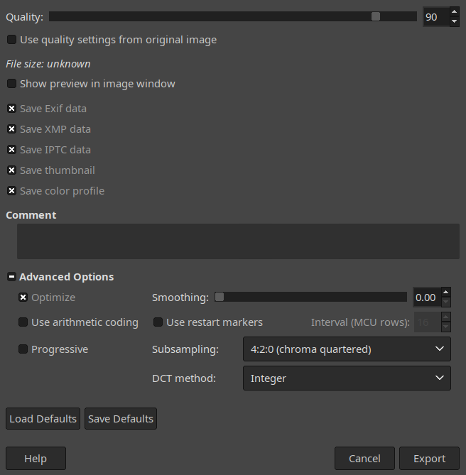
<figcaption>I'm pretty confident the only thing that needs to be changed is ticking off "Progressive" and changing "Subsampling" to what appears in the image, but I didn't test every single option to find out.</figcaption>
</figure>

Now just add the image to the ROM:

```sh
./cbfstool grub_8mb_withmac.rom add -f background-new.jpg -n background.jpg -t raw
```

You can confirm your changes by running `print` again. Though the file names are the same, the sizes are most likely different.

Finally, just flash this new image onto your machine like you would any other Libreboot ROM:

```sh
mv grub_8mb_withmac.rom grub_8mb_withmac_withbg.rom
sudo flashrom -p internal -w grub_8mb_withmac_withbg.rom -c YOURCHIPNAME -V
```

<!--
<h3>
<span id="Editing_the_internal_GRUB_config">Editing the internal GRUB config</span>
</h3>
<p>
TODO, working on it. <a href="https://libreboot.org/docs/gnulinux/grub_cbfs.html">Might want to check this out.</a>
</p>
-->

### Flashing{#Flashing}

Now with the chip clipped and the Pi turned on, you can proceed to the flashing phase. You can technically use your Pi directly, but I recommend SSHing into it once again and working from another device. But first, if you have prepared your Libreboot ROM in another machine, you can pass it to your Pi by doing:

```sh
scp my-ready-libreboot.rom pi@MYPIIP:~/x200
```


#### Making a copy of your stock BIOS

```sh
./flashrom -p linux_spi:dev=/dev/spidev0.0,spispeed=32768
```

If you get a message saying `No EEPROM/flash device found.`, it probably means you didn\'t connect the clip properly. **Power off the Pi first, then remove and readjust the clip.**

If instead you get something similar to the following:

```sh
Calibrating delay loop... OK.
Found Macronix flash chip "MX25L6405" (8192 kB, SPI) on linux_spi.
Found Macronix flash chip "MX25L6405D" (8192 kB, SPI) on linux_spi.
Found Macronix flash chip "MX25L6406E/MX25L6408E" (8192 kB, SPI) on linux_spi.
Multiple flash chip definitions match the detected chip(s): "MX25L6405", "MX25L6405D", "MX25L6406E/MX25L6408E"
Please specify which chip definition to use with the -c  option.
```

*Note that this also confirmed that my SOIC-16 chip is 8192 kB, i.e. 8 megabytes.*

Then you are ready to begin flashing. Hopefully you did actually write down your ROM model because you\'re gonna need it now (mine was MX25L6405). Before you actually flash Libreboot, you should dump the contents of your stock BIOS to have them as a back-up in case something goes wrong, and also to make sure that your clip is actually reading properly. Run the following to dump the contents of your stock BIOS:

```sh
./flashrom -p linux_spi:dev=/dev/spidev0.0,spispeed=32768 -r factory1.bin -V -c YOURROMCHIP --workaround-mx
```

Do this at least 2 times, changing `factory1` to `factory2` (and even `factory3`) in the command above. Once all the files have been dumped, compare them to see if the read is reliable:

```sh
sha1sum factory*
```

You should see a column of the same repeated string on the left and the names of the files on the right. If any of the strings on the left are different, then you do not have a reliable read. Try disconnecting everything and redoing to readjust the clip and/or make sure that your wires are not too long.

#### Flashing Libreboot{#Flashing_Libreboot}

If nothing went wrong when reading, then you are now ready to flash Libreboot!

```sh
./flashrom -p linux_spi:dev=/dev/spidev0.0,spispeed=32768 -w path/to/libreboot/rom/image.rom -V -c YOURCHIPNAME --workaround-mx
```

You might get errors claiming that an erase failed. Don\'t worry, they appeared to me and meant nothing. What you actually do want to see is the message `Verifying flash... VERIFIED.`. If you do, then it\'s all done!

Now, **unplup the Pi from power first**, then unclip the chip. Connect the X200 to power. If you see the iconic GRUB boot background, then congratulations my friend, you have just freed your BIOS! Welcome aboard, and enjoy the freedom!


[^1]: r/libreboot has been privated. [Here's the archive link](https://web.archive.org/web/20230610012646/https://old.reddit.com/r/libreboot/comments/7dajn6/x200_libreboot_tutorial_for_raspberry_pi_with/).
[^2]: I couldn't find the original link when passing this article over to my new website, the one linked is one I found that I think was the one I was originally referring to.

[^3]: According to [this](https://libreboot.org/docs/linux/grub_hardening.html#disable-the-seabios-menu), Libreboot releases after 20240504 all have SeaBIOS as their primary payload, with GRUB available in the boot menu. How to configure SeaBIOS/use only GRUB with these new releases is beyond the scope of this article. If you want to figure it out yourself, the most recent stable X200 ROMs (as of May 2026) are available under `stable/26.01rev1/roms/`, and the utilities used are available at `stable/26.01rev1/libreboot-26.01rev1_src.tar.xz`. If you want to follow this guide and use the specific ROM mentioned in this article, it is still available under `old/stable/20160907/..`.

[^4]: At the time of porting over this guide to my new website, NotABug seems to be down. This is a recurring issue, so Libreboot now has a [Codeberg repo](https://codeberg.org/libreboot/lbmk) for `lbmk`. The NotABug link provided may or may not work, depending on whether the service is up.

[^5]: See #3. That sidenote is pointless now.
