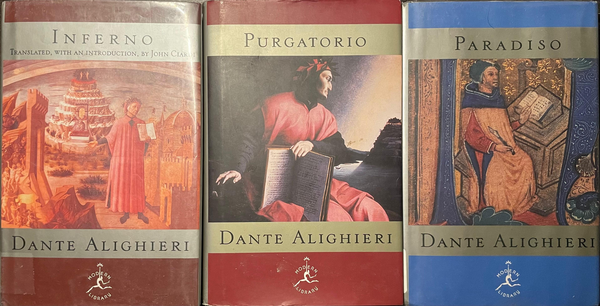
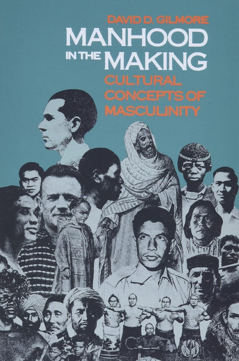

+++
date = '2024-12-06T21:02:59-06:00'
draft = false
title = 'Mi biblioteca personal'
tags = ["personal"]
toc = false
image = "cover.png"
+++

Dicen que puedes aprender mucho de un hombre en base a los libros que tiene en su estante. Presento aquí entonces, en ningún orden en particular, una lista casi exhaustiva de los libros que tengo físicamente. Dicho esto, no porque los tenga significa que los haya leído, y no porque un libro no aparezca aquí significa que no lo haya leído, pues francamente la mayoría de los libros los he pirateado digitalmente. Aun así, muchos de estos libros tienen un lugar especial en mi corazón, especialmente aquellos resaltados.

### Biblia "Dios Habla Hoy" (con Deuterocanónicos)
### Steve Jobs - Karen Blumenthal
### Fahrenheit 451 - Ray Bradbury
### How to Win Friends & Influence People - Dale Carnegie
### El Alquimista - Paulo Coelho
### Manual del guerrero de la luz - Paulo Coelho
### La era del vacío - Gilles Lipovetsky
### The Six Pillars of Self-Esteem - Nathaniel Branden
## **Inferno - Dante Alighieri (traducción de John Ciardi)**
## **Purgatorio - Dante Alighieri (traducción de John Ciardi)**
## **Paradiso - Dante Alighieri (traducción de John Ciardi)**

**

### La rebelión de las masas - José Ortega y Gasset
### Confesiones - San Agustín
### La inteligencia emocional - Daniel Goleman
### Atomic Habits - James Clear
### Los hermanos Karamazov (1 y 2) - Fyodor Mikhaylovich Dostoyevskiy
### King Warrior Magician Lover: Rediscovering the Archetype of the Mature Masculine - Robert Moore & Douglas Gillette
### Iron John - Robert Bly
## **Manhood in the Making: Cultural Concepts of Masculinity - David D. Gilmore**

**

### Discurso del método y Meditaciones metafísicas - René Descartes
### Sobre el inconveniente de tener muchos amigos (y otros ensayos) - Plutarco
### Moral Courage - Rushworth M. Kidder
### Nadie supo nada: La verdadera historia del asesinato de Eugenio Garza Sada - Jorge Fernández Menéndez
### Tu vida: tu mejor negocio - Salvador Alva
### Don Eugenio Garza Sada - Gabriela Recio Cavazos
### La raza cósmica - José Vasconcelos
### Breve historia de México - José Vasconcelos
### The Myths of Mexico and Perú - Lewis Spence
### Life at the Bottom: The Worldview that Makes the Underclass - Theodore Dalrymple
### Flow: The Psychology of Optimal Experience - Mihaly Csikszentmihalyi
### Sapiens: De animales a dioses - Yuval Noah Harari
### El lobo estepario - Herman Hesse
### YOUCAT Latinoamérica
### Imitación de Cristo - Tomás de Kempis
### Dios sí. Iglesia no. Respuestas fáciles a preguntas difíciles para jóvenes - Julio Muñoz López de Carrizosa, LC
### El príncipe - Nicolás Maquiavelo
## **1984 - George Orwell**
### The Art of War - Sun Tzu
### The Black Swan: The Impact of the Highly Improbable - Nassim Nicholas Taleb
### Antifragile: Things That Gain From Disorder - Nassim Nicholas Taleb
### Skin in the Game: Hidden Asymmetries in Daily Life - Nassim Nicholas Taleb
### La Biblia de Jerusalén - Great Adventure Bible
