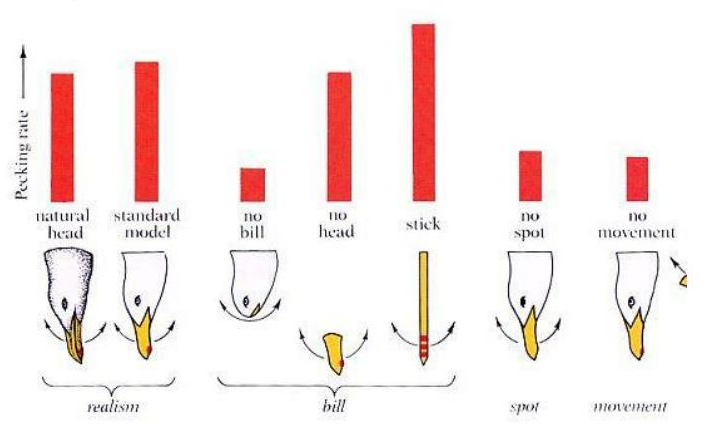

+++
date = '2024-12-17T23:32:51-06:00'
draft = false
title = 'On Modern Incontinence'
toc = false
image = "tinbergen.png"
tags = ["filosofía 👨‍👩‍👦"]
+++

<i>Esta es una de mis publicaciones viejas, escrita a finales del 2021. Me da un poco de cringe el estilo con el cual escribía antes, pero igual decido publicarla.</i>

## From ethology\...

In the 1940s, scientist Niko Tinbergen conducted several experiments on
the behavior of herring gulls. Adult herring gulls have a red dot on
their beaks, and newborn herring gulls will peck this dot to ask their
mother to regurgitate food. In one of his experiments, he designed a
fake cardboard beak, completely detached from a body, and offered it to
the chicks. He believed the chicks would ignore the dummy beak
altogether, but to his surprise, they pecked the red dot on this
cardboard beak just as much as they did the real one. Their attraction
to these red dots was clearly innate, not entirely learned. Tinbergen
then designed a series of beaks that changed the presentation of the dot
and studied the chicks\' reaction to them. Eventually, he designed a
beak that contained not one, but three unnaturally large and bright red
dots. When he presented it to them, the chicks turned frenetic, pecking
the beak as if it was the most joyous thing they were ever going to do.
Tinbergen studied other animals with similar innate attractions and
consistently found that he could exaggerate the characteristics of the
innately attractive to get the animals to react with an ardent desire
for it. He dubbed these \"supernormal stimuli.\"

<figure class="centerimg">

<figcaption>Some of Tinbergen's results.</figcaption>
</figure>

Why is this relevant? Well, the reactions of joyously desperate chicks
are quite adorable indeed\... until you realize that there must be a
human equivalent.

## \... to psychology 

For millennia, we developed innate instincts and desires
[[1]](#footnote-1) that promoted our survival and reproduction. Salts,
fats, and sugars became attractive because they were rare but necessary
for survival. We developed a unique curiosity towards all kinds of
information because it all related to our real world and our survival in
it. Sex became stimulating because it promoted the passing of genes.
Even our attraction to that which is cute developed as a mechanism to
care for the young and vulnerable.

But in modern times, with the introduction of mass production and
growing consumer markets, companies began to realize, whether
consciously or unconsciously, that they too can easily appeal to our
innate desires to sell a product. The problem with this is that being
incontinent and excessively submitting to these impulses is a surefire
recipe for self-destruction. The modern diet is completely foreign to
what our ancestors ate, particularly because it is overloaded with
salts, fats, sugars, and all that which our bodies aren\'t prepared to
receive in large quantities. The advent of the digital age has allowed
us to overwhelm ourselves with vast amounts of information, most of
which will be completely unproductive and will ultimately subtract an
ungodly amount of time off of our lives, but will guarantee clicks,
views, and revenue nonetheless. And merely out of respect for myself,
and perhaps also out of concern for my sanity, I won\'t discuss the
abhorrent amount of time and money thrown into the deep, dark hole that
is *kawaii* culture [\[2\]](#footnote-2).

Even so, companies are not the main culprits. They only ever meet
demand. By desiring to have our innate desires satisfied at every
moment, **we** have created an environment that specializes and
continually becomes more efficient at doing so, and it won\'t hesitate
to push us to self-destruction if we so wish. If we instead wish to
avoid such a fate, then it is in our best interest we think twice about
following our desires. We shall here explore how mindlessly following
our impulses has fostered this dangerous environment and will continue
to strengthen it unless we stop it.

## How to sell

Incontinence is an easy concept to understand. Just as an object in
motion remains in motion unless acted upon by another force, our
biological pull towards satisfying our innate desires will continue even
when it becomes counterproductive, unless we consciously attempt to stop
it. Traditional moral systems have historically been the force that
stopped this biological pull when it became self-destructive. Presently,
for reasons outside the scope of this article, these have greatly
diminished. The majority of people now have a vague understanding of or
even little interest in morality and distinguishing right from wrong,
and in this pop understanding of morality, incontinence falls
increasingly on the right side. If you\'re a company looking to sell a
product or a government looking to grow its economy, this is quite
convenient. Strong moral principles would simply sway demand against a
wide variety of consumptive habits. You can\'t sell sex to an abstainer
or alcohol to a teetotaler. Fortunately for you, however, your potential
consumers are already biologically primed towards fulfilling certain
innate desires as much as possible. You need only to offer them the
stimuli with which they can satisfy their craving, and then, with no
other act on your behalf, they will bite. Best of all, once they bite
it, few will hardly ever let go. Through habit their incontinence will
only reinforce itself, and they will return to you. The irony here is
that they will come to see their loyalty to you as an expression of
themselves, and some will even defend your business and your right to
operate in the \"free\" market, when in reality, their better judgment
overridden by their own incontinence, **your own consumers have stopped
fully consenting to their consumption**.

Unfortunately for you though, your products will almost certainly not be
the only fish in the sea. You will be fighting other companies for the
limited amount of time and money your potential customers have. To
ensure your continual survival, you must create products that
increasingly maximize customer satisfaction. Of course, you could try to
design a product that satisfies customers by actually providing a
benefit to them, undoubtedly some will, but if your goal still is to
maximize profits, then the sad reality is that in this world what
customers need does not outsell what customers want (or worse, what they
*think* they need), and customers ardently want their innate desires
satisfied. Thus, anyone looking to acquire as much capital as possible
**will** eventually have to betray its customers\' best interests and
push them towards incontinence. Now picture every company in the planet
trying to do so, and by mere Law of Least Effort, it becomes easier to
see why so many people today are slaves to their own impulses.

## Escape the supernormal

What can be done about it? Frankly, I won\'t pretend I\'m too interested
in the large-scale transformation of our society. We all receive what we
dare to seek, and those who seek their own destruction will justly find
it. If, however, you belong to the few who seek to avoid it, then I can
at least offer some guidance on this less traveled path, taken from my
own personal experience.

Our innate desires aren\'t inherently evil. Information, calories, and
even sexual gratification, though to a much lesser extent, are all part
of a good life. It is only when we corrupt or overuse these stimuli that
they become a force for evil in our lives. Engaging with stimuli this
way does feel pleasant, but, as you may already know, this will only
last a moment. The next dose of this stimulus will not be as pleasing,
and the more you try to chase its pleasure, the less it is within your
reach. What you may not know, however, is that as your brain adjusts
itself to the pleasure received from the stimulus, it becomes dependent
on it to function properly. In other words, the supernormal becomes
normal, the normal becomes tedious, and the challenging, where the
essence of life truly resides, becomes unbearable. Conversely, when one
rigorously abstains from corrupted and excessive pleasures, the normal
itself can become supernormally pleasing. Believe me, Reader, whatever
you seek out of life, it is not to be found in banal pleasures. Choose
to see the beauty in the normal.

## Notes

[1] Innate instincts, desires, cravings and
impulses are used interchangeably here.

[2] These are only some of the negative
consequences of supernormal stimuli, and some of the bleaker ones at
that. See *Supernormal Stimuli* below for more information on the true
harms of supernormal stimuli.

## See also

#### *Atomic Habits*, James Clear

The book in which I first learned about supernormal stimuli. Note that
this book deals with the science behind behavior, not directly
supernormal stimuli. Still, I\'m sure those willing to break free from
incontinence will find this book to be of use.

#### *Supernormal Stimuli: How Primal Urges Overran Their Evolutionary Purpose*, Deirdre Barrett:

A book I stumbled upon while researching more on the topic. I cannot
recommend this enough if you wish to learn more about supernormal
stimuli themselves and their true potential for self-destruction.
