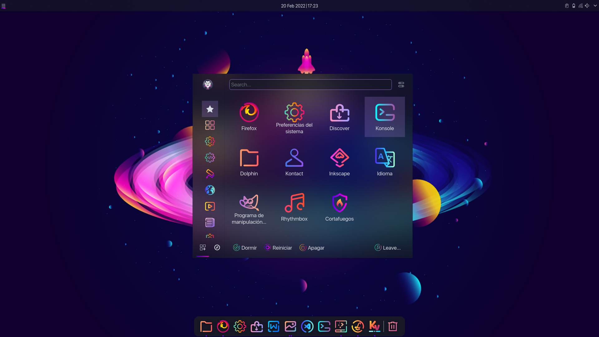
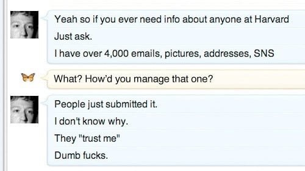

Este artículo es una versión un poco más seria de [mi video
explicando las razones por las cuales Linux vale la
pena](https://www.youtube.com/watch?v=yFrPN0YYdoY). En ese
video hablé más sobre las generalidades de Linux que merecen
ser consideradas, sin embargo en este artículo hablaré
primero sobre mi experiencia personal con Linux y después
sobre la relevancia política de este sistema operativo.

### Mi trayectoria personal
Técnicamente mi primer encuentro con Linux fue durante el
último año de secundaria circa 2017. Francamente era
bastante nerdo y me estaba volviendo bueno con la
programación, y había escuchado de esta oscura cosa llamada
Ubuntu en la cual era más fácil instalar y utilizar ciertas
herramientas y librerías de Python (según yo iba a entrenar
mi propia inteligencia artificial a la Jarvis de Iron Man).
Fue aquí donde primero conocí el concepto de dual-boot, sin
embargo más allá de eso y aún teniéndolo en mi unidad no
aprendí mucho pues pronto abandoné la idea de programar en
Linux. Probablemente ni siquiera arranqué el sistema más de
cinco veces.

Sería poco antes del 2019 que realmente comencé a meterme al
mundo de Linux. Bajo riesgo de sonar superficial, la verdad
al inicio lo que más me llamó la atención fue la
personalización y lo bien que se veía KDE Plasma. En ese
entonces creo que no sabía que podía instalarlo sobre
Ubuntu, o tal vez el elitismo de Arch ya me estaba logrando
convencer, pero decidí aprender sobre los dos de golpe.

Definitivamente hice el proceso de instalación de Arch más
de diez veces. Unas veces lo hacía porque me aparecía un
error que no sabía solucionar, otras porque cometía un error
para el cual pensaba que no había vuelta atrás y aún otras
simplemente porque estaba tan perdido con lo que estaba
haciendo (ya sea durante o después de la instalación) que lo
consideraba mejor simplemente comenzar de nuevo. Esto lo
comento en parte para reír, en parte para destacar que más o
menos así es el proceso bajo el cual la mayoría de las
personas se familiariza con Linux (o cualquier tecnología
técnica), por lo cual no deberías frustrarte si tu
experiencia es algo similar. Hoy cuento con la habilidad
técnica suficiente como para reconocer que muchas de las
razones por las cuales desinstalé y reinstalé se pudieron
haber resuelto sin tal medida drástica, sin embargo no creo
que hubiera logrado adquirir dicha habilidad sin primero
contar con esta mentalidad de prueba y error donde uno es
aventado para probar y en el error no pierde nada.

Pasé mucho tiempo personalizando Plasma y sus programas,
primero su estética y después su funcionalidad. Fue aquí
donde me di cuenta de lo amplia que era la libertad de
personalización en este entorno. Casi me atrevo a decir que
en verdad todo podía ser cambiado, si no mediante un GUI, sí
en los archivos de configuración (razón por la cual me he
encariñado más con Plasma que GNOME). Incluso recuerdo que,
cuando comencé a conocer sobre el mundo de los gestores de
ventanas en mosaico, me tomó mucho tiempo decidir soltar
Plasma por uno de estos, pues siempre pude configurar KWin
para que actuara como uno.

Eventualmente, sin embargo, me atrajo la idea de poder
lograr lo mismo con menos recursos, y estos gestores de
ventanas parecían lograr justo eso. Intenté i3 por un rato,
pero fue dwm el cual verdaderamente me convenció.  Ahora que
sólo contaba con lo más esencial, verdaderamente me
desarrollé en el mundo de la terminal y los programas
dependientes en esta, lo cual de nuevo me abrió las puertas
a un nuevo mundo antes desconocido. Saltándome mi tiempo de
experimentación con ThinkPads viejas, Parabola
GNU/Linux-libre, Libreboot y Artix, llegamos a donde me
encuentro en el presente.

Todo esto lo menciono porque cada gran paso que tomé para
adentrarme al mundo de Linux, desde instalar Ubuntu hasta
decidir utilizar dwm, me fue revelando que **el mundo del
software libre es infinitamente mejor** a comparación de lo
que conoce la mayoría de las personas encerradas en
Apple/Windows. Por más que yo escriba aquí, en realidad las
diferencias y los beneficios sólo pueden ser apreciados por
quienes han utilizado estas herramientas libres,
especialmente si miran en retrospectiva, de tal manera que
uno no logra comprender cómo pudo vivir tan limitadamente en
el mundo del software propietario. Aún así, presentaré los
dos argumentos de por qué considero que el software libre es
mejor que el propietario, que son el argumento pragmático y
el argumento moral.

### Las computadoras como siempre debieron ser

La libertad que ofrece el software libre en un sentido
pragmático es producto de la naturaleza del entorno bajo el
cual se desarrolla. Mientras que el software propietario
frecuentemente se desarrolla de arriba hacia abajo ---por
desarrolladores cuya preocupación principal es complacer a
sus jefes que complacer y cumplir con sus metas---, el
software libre se desarrolla de abajo hacia arriba, creado
por uno o varios usuarios apasionados por el software que
desarrollan. Para estos últimos desarrolladores, su software
es menos un medio y más un fin, una obra creada por amor al
arte. En el argot de Nassim Taleb, estos últimos tienen su
alma en juego, hacen cosas por razones existenciales antes
que financieras y comerciales y evitan la industrialización
de su arte, mientas que los primeros son todo lo contrario.
Esto hace que la experiencia de usuario sea radicalmente
diferente entre los dos tipos de software desarrollados.

Los desarrolladores de software libre, al ser ellos mismos
ávidos usuarios, generalmente tienen una mejor idea de
qué es lo que los usuarios buscan de su software, y saben
también que lo mejor es [desarrollar herramientas
flexibles](https://en.wikipedia.org/wiki/Unix_philosophy)
para que el usuario las aplique a sus casos únicos,
razón por la cual Linux es bastante personalizable. Esto
es todavía más cierto para el software desarrollado bajo el
modelo de código abierto, ya que al ser desarrollado por
varias personas las herramientas desarrolladas son, con cada
*commit*, diseñadas al rededor de las necesidades de diversos
usuarios.

El desarrollo de software propietario, por otro lado, es
completamente diferente. No viene de los usuarios, como es
frecuentemente el caso con el software libre, sino que
funciona, de nuevo, de arriba hacia abajo, de tal manera que
se imponen cambios sobre los usuarios. Si alguna vez te
preguntaste por qué Microsoft cambia la apariencia de
Windows y Word todo el tiempo sin presentar algún beneficio
claro en ello, es por esto. Su preocupación principal no es
la calidad del software, ni mucho menos escuchar a sus
usuarios, sino seguir tendencias a fin de mantener sus
productos relevantes y así generar una ganancia.

Esto aplica todavía más para las redes sociales y otros
servicios que no sólo imponen cambios sobre sus usuarios,
sino que aprovechan dicha posición para imponer cambios
nocivos para sus usuarios ---cambios que pretenden
manipularlos, al menos, para pasar una cantidad enfermiza de
horas en sus plataformas. Aunque, seamos sinceros, con lo
ventajosa que es la posición en la cual se encuentran los
proveedores del software propietario como servicio, ¿es
realmente difícil creer que la utilizan por ganancia
política y personal?

### El lado ético del software libre

Ello da pié al segundo y más importante argumento a favor
del software libre, el argumento moral. La realidad de las
cosas es que **la tecnología ha invadido demasiados aspectos
de nuestras vidas**, volviéndose algún tipo de leviatán que
todo lo abarca, y mediante el software propietario, las
grandes empresas se reservan el derecho de controlar cada
vez más ámbitos de nuestras vidas. Ello es más que una
cuestión de privacidad, como se presenta en el discurso
popular, pues mientras más dependiente se vuelve la vida
cotidiana en la tecnología, más vectores existen para
permitir la ingerencia de quienes controlan dicha
tecnología, y con ello, **cada vez más derechos pueden ser
violados**. ¿Derecho a la libertad de expresión? [Buena
suerte con
eso](https://web.archive.org/web/20250331095347/https://nypost.com/2022/12/08/suppression-of-right-wing-users-exposed-in-latest-twitter-files/).
¿Derecho a la propiedad privada? No existe para ti en línea,
pero [nos reservaremos nuestros derechos de
autor](https://www.pastemagazine.com/tech/digital-media/sony-playstation-discovery-digital-ownership).
¿Derecho a la libre movilidad? No te preocupes, [sabemos
dónde estás](https://www.youtube.com/@TectonixGEO/videos).

Ahora bien, es cierto que el software libre probablemente no
pueda resolver todas estas cuestiones ---en realidad, quizá
sea la dura realización de que no todo debe ser
tecnologizado---, sin embargo, adoptarlo y adoptar su
mentalidad de libertad e independencia indudablemente podrá
ayudar a mejorarlos. Las [redes sociales
distribuidas](https://en.wikipedia.org/wiki/Distributed_social_network)
son una excelente manera de proteger la libertad de
expresión digital. Los usuarios pueden ser verdaderos dueños
de lo que consumen si optan por opciones libres sobre
plataformas propietarias y contenido con
[DRM](https://en.wikipedia.org/wiki/Digital_rights_management).
El rastreo de geolocalización de un programa puede ser
deshabilitado por quienes puedan modificar su código. En
resumen, el software libre permite que el poder quede en
manos de los muchos usuarios, no de los pocos quienes crean
el software, y vale la pena apoyarlo a fin de evitar una
tiránica y totalitaria invasión de nuestros derechos.

